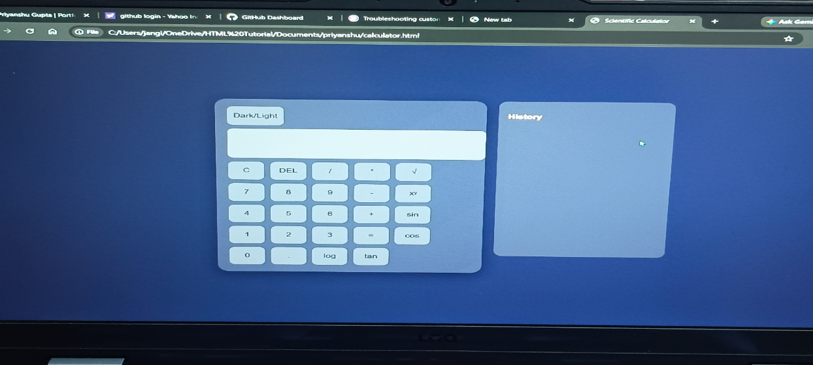
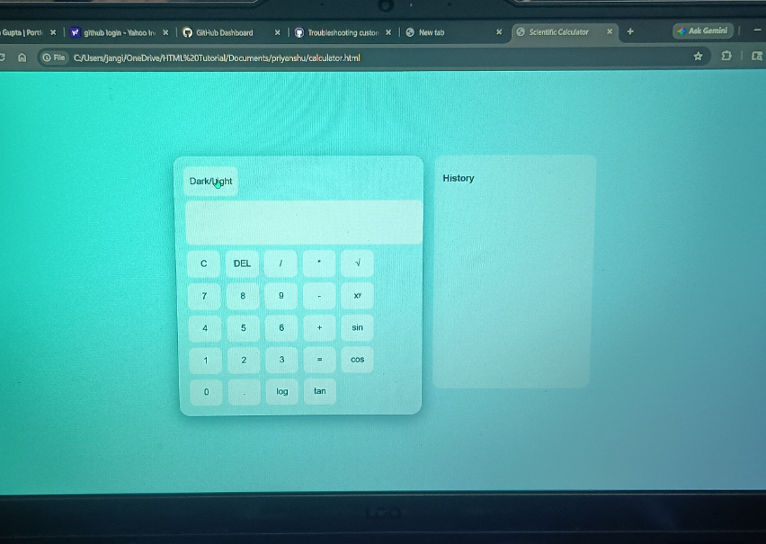
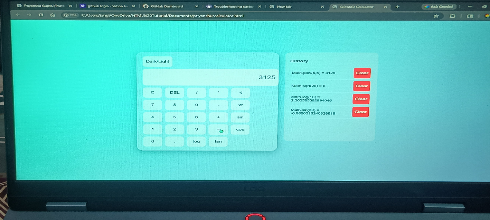
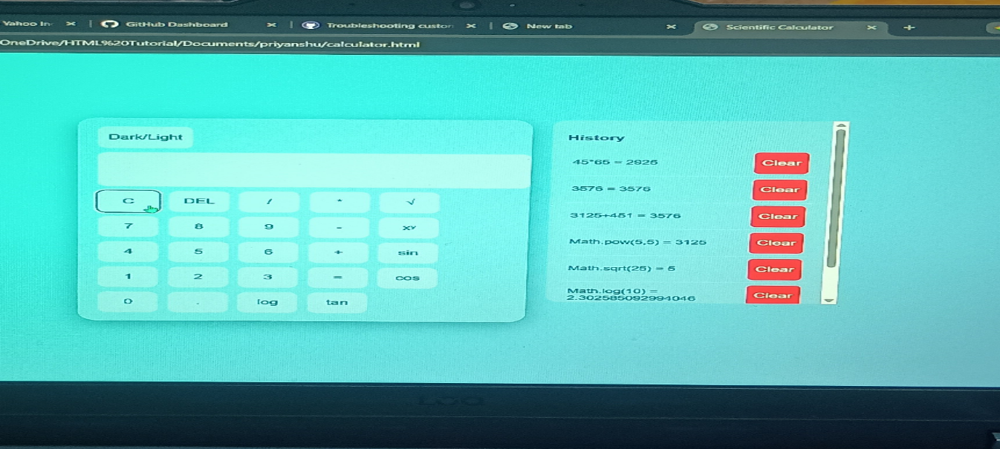
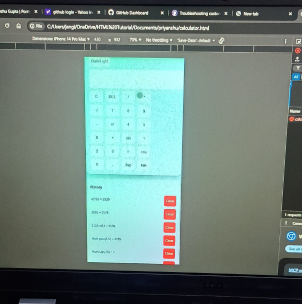

# Advanced Scientific Calculator

A responsive scientific calculator built using HTML, CSS, and JavaScript.

## Features
- Basic arithmetic operations
- Scientific functions
- History with LocalStorage
- Clear single history / Clear all history
- Keyboard support
- Dark/Light mode
- Mobile responsive design

## Technologies Used
- HTML
- CSS
- JavaScript
- LocalStorage

## Live Demo
https://priyanshu1608-cyber.github.io/Scientific-calculator-js/

## Screenshots

### Dark Mode

### Light Mode

### Scientific Functions

### History Panel

### Mobile Responsive

## Author
Priyanshu
